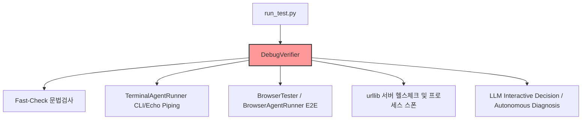
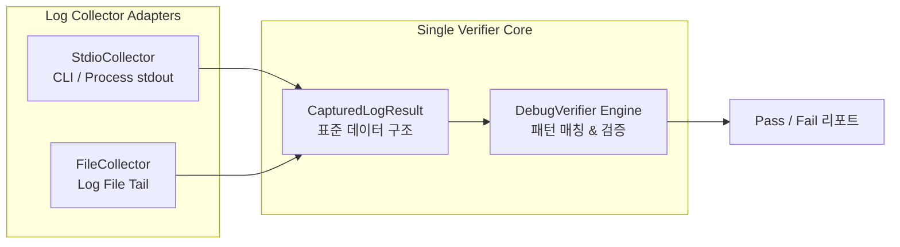

# 🛠️ 디버깅 모듈 체계화 및 구조 정리 계획서 (Debug Module Refactoring Plan)

> **문서 상태**: Draft (v1.0)  
> **목적**: 무분별하게 확장되어 복잡도가 가중된 디버깅 로그 수집 및 검증 파이프라인(`debug_verifier.py`, `run_test.py` 등)을 단일 표준 아키텍처로 리팩토링하고, 단계별 확장 로드맵을 수립한다.

---

## 1. 🔍 현재 로직 진단 & 문제점 분석 (Current State Analysis)

현재 시스템(`agent_core/validation/debug_verifier.py`, `run_test.py`)은 **"모든 종류의 앱(CLI, 브라우저, 백그라운드 서버, GUI 등)의 디버깅 로그를 한 번에 자동 검증한다"**는 목표를 하향식(Top-down)으로 처리하려다 보니 아키텍처적 비효율과 체계 붕괴가 발생했습니다.



### 핵심 문제점 요약

1. **책임의 경계 부재 (Collector와 Verifier의 강한 결합)**
   * `DebugVerifier` 단일 클래스(565줄) 내에 **프로세스 실행, CLI stdin 파이핑, 브라우저 렌더링, 서버 기동 헬스체크, 정규식 검증, LLM 대화 판단, 자율 진단**이 모두 얽혀 있습니다.
   * 이로 인해 로그 수집 방식 하나를 수정하면 검증 로직 전체가 흔들리는 구조적 병목이 발생합니다.

2. **수집 채널 및 실행 대상 범위의 무분별한 혼재**
   * 터미널 CLI 실행(`TerminalAgentRunner`)과 브라우저 E2E(`BrowserTester`), 백그라운드 멀티 서버 띄우기(`urllib.request.urlopen`)가 하나의 흐름에서 분기문으로 처리되어 일관성이 없습니다.

3. **디버그 로그 스펙(`debug_log_spec`)의 표준 규격 부재**
   * 미션 파일(`mission.json`)마다 `log_pattern`, `expected_terminal_outputs`, `browser_test_spec`, `interactive_inputs` 등이 서로 다른 키로 제각각 선언되어 수집기가 혼란을 겪습니다.

4. **과도한 LLM 피드백 루프 (I/O 병목 및 토큰 낭비)**
   * 정규식 불일치 시 마다 LLM 대화형 입력 판단, LLM Semantic Judge, LLM 자율 진단 에이전트가 3중 4중으로 겹쳐 실행되어 속도가 느리고 실패 원인을 직관적으로 파악하기 어렵습니다.

---

## 2. 💡 추천 해결 방안 (Immediate Resolution Plan - MVP Scope)

현재의 복잡도를 **10분 내로 80% 이상 낮추는 핵심 원칙**은 **"수집(Collector)과 검증(Verifier)의 완벽한 분리"**와 **"MVP 지원 대상의 칼같은 축소"**입니다.



### 1) MVP 지원 범위 확정 (2가지 채널로 축소)
지금 단계에서는 **오직 아래 2가지 디버그 수집 채널만 정식 지원**하고, 브라우저/GUI/백그라운드 서버 등은 `Deferred(이연)` 모듈로 격리합니다.

* **Target 1: Stdio (콘솔 표준 출력)** — Python/Node CLI 툴, 단독 테스트 스크립트의 `stdout`/`stderr`
* **Target 2: File (로그 파일)** — 백그라운드 프로세스나 로깅 라이브러리가 출력하는 `.log` / `.txt` 파일

### 2) 단일 표준 로그 스키마 정의 (`schemas.py`)
수집 방식에 상관없이 모든 수집기(Collector)는 검증기에 **동일한 Pydantic 데이터 구조**를 반환하도록 고정합니다.

```python
# agent_core/validation/schemas.py

from pydantic import BaseModel
from typing import List, Optional, Dict, Any

class DebugLogSpec(BaseModel):
    """미션 파일 내 디버그 스펙 표준 구조"""
    channel_type: str  # "stdio" | "file"
    log_file_path: Optional[str] = None  # channel_type이 "file"일 때 필수
    expected_patterns: List[str]  # 검증할 정규식 또는 문자열 패턴 목록
    env_toggles: Dict[str, str] = {}  # 주입할 디버그 환경변수 (예: {"DEBUG": "1"})

class CapturedLogResult(BaseModel):
    """수집기가 채널에서 읽어들인 표준 결과물"""
    success: bool
    channel_type: str
    raw_logs: str
    error_message: Optional[str] = None
```

### 3) Collector Adapter 아키텍처 도입
로그를 가져오는 로직을 추상 클래스 아래로 분리합니다.

```python
# agent_core/validation/collectors/base.py

from abc import ABC, abstractmethod
from agent_core.validation.schemas import DebugLogSpec, CapturedLogResult

class BaseLogCollector(ABC):
    @abstractmethod
    def collect(self, spec: DebugLogSpec, entrypoint_cmd: str, cwd: str) -> CapturedLogResult:
        pass
```

* `StdioCollector`: `subprocess.Popen`으로 명령어를 실행하고 `stdout/stderr` 스트림을 캡처하여 `CapturedLogResult` 반환.
* `FileCollector`: 명령어를 실행하거나 이미 동작 중인 상태에서 `log_file_path` 파일의 텍스트를 읽어 `CapturedLogResult` 반환.

### 4) `DebugVerifier` 다이어트 (565줄 → 120줄로 단순화)
`DebugVerifier`는 이제 **"어떻게 실행하고 수집하는가"**를 일절 신경 쓰지 않고, 오직 `CapturedLogResult`를 받아 패턴 매칭 검증만 수행합니다.

```python
class DebugVerifier:
    def verify(self, spec: DebugLogSpec, captured: CapturedLogResult) -> Dict[str, Any]:
        if not captured.success:
            return {"verified": False, "failure_type": "COLLECTION_ERROR", "message": captured.error_message}
            
        matched, missing = [], []
        for pattern in spec.expected_patterns:
            regex = build_log_regex_pattern(pattern)
            if re.search(regex, captured.raw_logs, re.MULTILINE):
                matched.append(pattern)
            else:
                missing.append(pattern)
                
        is_verified = (len(missing) == 0)
        return {
            "verified": is_verified,
            "failure_type": "NONE" if is_verified else "LOG_PATTERN_MISMATCH",
            "matched_patterns": matched,
            "missing_patterns": missing,
            "output": captured.raw_logs
        }
```

---

## 3. 🚀 앞으로의 확장 계획 (Future Expansion Roadmap)

검증기 코어(`DebugVerifier`)와 표준 스키마(`CapturedLogResult`)를 1단계에서 단선화해 두었기 때문에, 추후 다른 복잡한 프로그램 환경을 추가할 때 **기존 코드를 건드리지 않고 신규 Collector Adapter만 추가**하면 됩니다.

```
[Phase 1: MVP] ───────► [Phase 2: Web & Server] ──────► [Phase 3: GUI & Native]
- StdioCollector        - BrowserLogCollector            - DesktopAppCollector
- FileCollector           (CDP / Console Interceptor)      (OS Event / IPC Pipe)
                        - ServerLogCollector             - LibraryHookCollector
                          (Daemon + Healthcheck)           (Logging Handler Injection)
```

### 🔮 Phase 2: 웹 & 백그라운드 서버 확장 (Next Step)
1. **`BrowserLogCollector` (웹 앱 디버깅)**
   * Chrome DevTools Protocol(CDP) 또는 Playwright/Puppeteer 연동.
   * 브라우저 콘솔(`console.log`, `console.error`) 및 Network 실패 요청을 캡처하여 `CapturedLogResult` 생성.
2. **`ServerLogCollector` (백그라운드 서비스 디버깅)**
   * 서버 데몬 기동 -> `healthcheck` 포트 대기 -> 서버 생성 로그 파일 및 stdout 통합 수집.

### 🔮 Phase 3: GUI & 특수 라이브러리 확장 (Advanced Step)
1. **`DesktopAppCollector` (GUI/데스크톱 앱)**
   * Windows/Linux OS Event Viewer 감시 또는 애플리케이션 Custom Pipe/Socket 연동 수집.
2. **`LibraryHookCollector` (Python/Node 라이브러리)**
   * 파이썬 `logging.Handler`를 동적 주입(Monkey-patching)하여 메모리 내 로그 수집.

---

## 4. 📋 마이그레이션 실행 로드맵 (Action Items)

| 단계 | 작업 내용 | 담당 모듈/파일 | 목표 |
| :---: | :--- | :--- | :--- |
| **STEP 1** | 디버그 표준 스키마 작성 | `agent_core/validation/schemas.py` | `DebugLogSpec`, `CapturedLogResult` 정의 |
| **STEP 2** | Collector 수집기 분리 | `agent_core/validation/collectors/` | `StdioCollector`, `FileCollector` 구현 |
| **STEP 3** | Verifier 코어 다이어트 | `agent_core/validation/debug_verifier.py` | 565줄 → 120줄 경량화 (브라우저/LLM피드백 분리) |
| **STEP 4** | 미션 파일 및 파이프라인 연동 | `run_test.py` & `mission.json` | 신규 수집 파이프라인 적용 검증 |

---
*이 계획서에 따라 1단계 마이그레이션을 진행하면, 디버깅 로그 수집 로직이 명확해지고 에이전트 개발 및 디버깅 시 발생하는 혼란이 완벽히 해소됩니다.*
